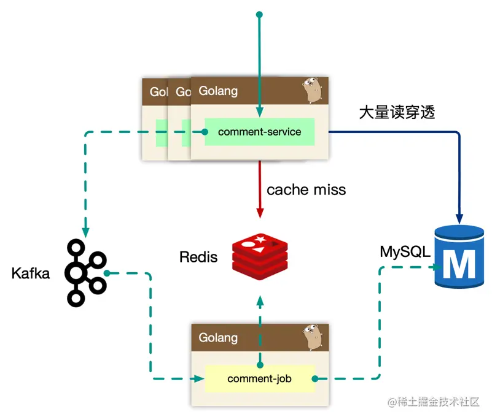

# 评论系统

## run
```
go install github.com/go-kratos/kratos/cmd/kratos/v2@latest
kratos run
```

## config
```
  database:
    driver: mysql
    source: root:password@tcp(127.0.0.1:3306)/comment?parseTime=true
  redis:
    addr: 127.0.0.1:6379
  kafka:
    addrs:
      - localhost:9092
```
## schema

```sql
CREATE TABLE `comment_content` (
  `id` bigint NOT NULL AUTO_INCREMENT,
  `obj_id` bigint NOT NULL,
  `owner_id` bigint NOT NULL,
  `root` bigint NOT NULL DEFAULT '0',
  `floor` int NOT NULL DEFAULT '0',
  `message` varchar(255) NOT NULL DEFAULT '',
  `created_at` timestamp NOT NULL DEFAULT (now()),
  `updated_at` timestamp NULL DEFAULT NULL,
  PRIMARY KEY (`id`)
) ENGINE=InnoDB AUTO_INCREMENT=14 DEFAULT CHARSET=utf8mb4 COLLATE=utf8mb4_0900_ai_ci

CREATE TABLE `comment_index` (
  `id` bigint NOT NULL AUTO_INCREMENT,
  `content_id` bigint NOT NULL,
  `obj_id` bigint NOT NULL,
  `owner_id` bigint NOT NULL,
  `root` bigint NOT NULL DEFAULT '0',
  `parent` bigint NOT NULL DEFAULT '0',
  `floor` int NOT NULL DEFAULT '0',
  `like` int NOT NULL DEFAULT '0',
  `hate` int NOT NULL DEFAULT '0',
  `state` tinyint NOT NULL DEFAULT '0',
  `created_at` timestamp NOT NULL DEFAULT (now()),
  `updated_at` timestamp NULL DEFAULT NULL,
  `next_floor` int DEFAULT '0',
  `count` int DEFAULT NULL,
  PRIMARY KEY (`id`)
) ENGINE=InnoDB AUTO_INCREMENT=10 DEFAULT CHARSET=utf8mb4 COLLATE=utf8mb4_0900_ai_ci


CREATE TABLE `comment_subject` (
  `id` bigint NOT NULL AUTO_INCREMENT,
  `owner_id` int NOT NULL,
  `count` int NOT NULL DEFAULT '0',
  `next_floor` int NOT NULL DEFAULT '0',
  `state` int NOT NULL DEFAULT '0',
  `created_at` timestamp NOT NULL DEFAULT (now()),
  `updated_at` timestamp NULL DEFAULT NULL,
  PRIMARY KEY (`id`)
) ENGINE=InnoDB AUTO_INCREMENT=3 DEFAULT CHARSET=utf8mb4 COLLATE=utf8mb4_0900_ai_ci

```


## 参考

极客时间的课程，详情可参考blog：[评论系统架构设计](https://juejin.cn/post/6907187734696165389)



## 技术

- [Kratos](https://go-kratos.dev/)
- [Kafka](https://kafka.apache.org/)
- [Entgo](https://entgo.io/)

